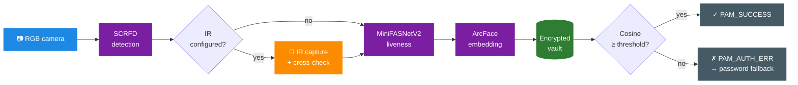
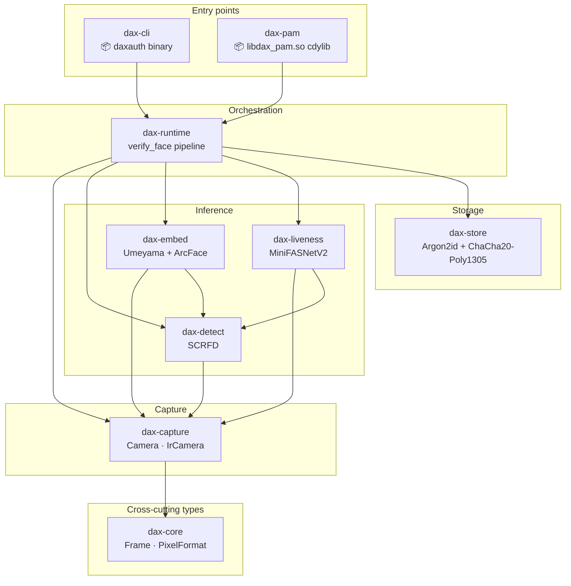

<div align="center">

# 👁️ dax-auth

**Windows Hello-grade face authentication for Linux, written in Rust.**

PAM module, encrypted on-disk vault, RGB ↔ IR cross-check, passive liveness — entirely on-device, no cloud, no telemetry.

[](https://www.rust-lang.org/)
[](https://github.com/rust-lang/rust)
[](LICENSE)
[](#requirements)
[](https://www.linux-pam.org/)
[](https://onnxruntime.ai/)
[](#status)
[](#contributing)

</div>

---

## TL;DR

```sh
git clone https://github.com/daxrpm/dax-auth.git
cd dax-auth && git checkout rust
./scripts/install.sh        # interactive — installs binary, PAM module, models
sudo daxauth enroll         # 5 captures of your face (auto liveness gate)
sudo daxauth verify         # confirm cosine match
sudo ./scripts/install.sh   # menu 2: wire libdax_pam.so into /etc/pam.d/sudo
sudo -K && sudo ls          # next sudo: face instead of password
```

> [!IMPORTANT]
> This project is **alpha**. The pipeline has not been third-party audited.
> Always wire it as `auth sufficient` so the password path remains as fallback.
> Open a recovery shell **before** modifying any production PAM stack.

---

## ✨ Highlights

|  |  |
|---|---|
| 🔒 **Encrypted vault** | Argon2id (RFC 9106 baseline: 64 MiB / 3 / 4) + ChaCha20-Poly1305 AEAD, atomic writes, key zeroisation. |
| 👁️ **Hello-grade liveness** | Optional RGB ↔ IR cross-check — phone screens and photos fail because they don't reflect IR like skin. |
| 🛡️ **Hardened PAM module** | Ignores all `DAX_*` env vars (attacker-controlled in PAM context) and validates root ownership of config + secret files. |
| 🤖 **Passive anti-spoofing** | MiniFASNetV2 (3-class: live / print / replay) on every verify. |
| 🧠 **State-of-the-art models** | InsightFace SCRFD-500MF + MobileFaceNet, both Apache-2.0. |
| ⚙️ **Multi-distro installer** | Detects Fedora / Debian / Ubuntu / Arch / openSUSE / Alpine, picks the right packages and PAM directory. |
| 🦀 **No `unsafe` outside the PAM C-ABI shim** | `unsafe_code = "deny"` workspace-wide; clippy pedantic warnings as errors in CI. |
| ⚡ **Fast** | ~150 ms end-to-end on a modern laptop CPU; no GPU required. |

---

## 🔁 Pipeline



Every gate fails closed: a covered lens stops at SCRFD, a phone screen at the IR cross-check, a printed photo at MiniFASNetV2, a similar-looking impostor at the cosine threshold.

---

## 🚀 Quick start

### Requirements

- Linux with V4L2 (kernel ≥ 5.x). Tested on Fedora 43.
- A V4L2 RGB webcam. An IR sensor is **optional** — when absent, the cross-check silently degrades.
- Rust toolchain (rustup) — pinned to stable via `rust-toolchain.toml`.
- For PAM testing: `pamtester`, installed by the installer when you ask for it.

### 1. Clone & fetch models

```sh
git clone https://github.com/daxrpm/dax-auth.git
cd dax-auth && git checkout rust
./scripts/fetch-models.sh
```

The script downloads InsightFace `buffalo_s` (~17 MB) and yakhyo's `MiniFASNetV2.onnx` (~1.7 MB). Both are **Apache-2.0**. Each archive's SHA-256 is hard-coded in the script and verified before extraction.

### 2. Install system-wide

```sh
./scripts/install.sh
```

The interactive installer:

- detects your distribution and PAM directory
- offers to install the system prerequisites (`pam-devel` / `libpam0g-dev` / `pam`, `v4l-utils`, `pamtester`, `gcc`, …)
- builds the release artefacts on demand
- copies binary, `.so`, models to standard locations
- generates `/etc/dax-auth/config.toml` and a random `/etc/dax-auth/secret` (0600 root)
- creates `/var/lib/daxauth/` with 0700 root

Re-run it any time to **verify** an install, **uninstall**, or **add/remove** the PAM line in any `/etc/pam.d/<service>` (it backs up the file with a timestamp first).

### 3. Enrol your face

```sh
sudo daxauth enroll       # uses $SUDO_USER, paths from config, passphrase from secret
```

You'll see five captures with short pauses; move slightly between them (small head turns, blinks). Each capture has to pass detection + liveness gates before being added to the vault.

### 4. Verify it works

```sh
sudo daxauth verify
```

You should see:

```text
✓  dax-auth  authenticated  ·  sim 70%  ·  live 99%  ·  ir ok
```

When that line is green, run `./scripts/install.sh` again, pick **`Configure PAM service`**, type `sudo`, accept the defaults, and the next time the sudo cache expires (`sudo -K` to force) you authenticate with your face.

> [!TIP]
> Test-drive the PAM module without touching `/etc/pam.d/sudo` by using `pamtester` against the dummy service the installer creates: `./scripts/pamtest.sh`.

---

## 🧰 Subcommand reference

| Command | What it does |
|---------|-------------|
| `daxauth devices` | Lists every V4L2 capture node with its FourCCs (RGB vs IR). |
| `daxauth snap [-d N -o file]` | Captures one RGB frame to disk (JPEG/PNG by extension). |
| `daxauth snap-ir [-d N -o file]` | Same, for an IR sensor — emits 8-bit grayscale. |
| `daxauth detect [-m model -i img -o anno]` | Runs SCRFD on an image and optionally writes an annotated copy. |
| `daxauth embed [--detector --recognizer -i img]` | Computes the L2-normalised 512-D embedding. |
| `daxauth compare … -a A.jpg -b B.jpg` | Cosine similarity between the faces in two images. |
| `daxauth liveness …` | Passive anti-spoofing verdict on a single image. |
| **`daxauth enroll`** | Multi-capture enrolment into the encrypted vault. |
| **`daxauth verify`** | One-shot authentication (used by both the CLI and the PAM module). |
| `daxauth vault {init,list,remove}` | Empty-vault creation, listing, per-user template removal. |

When you are root and the system config exists, **`enroll`, `verify`, and `vault list/remove` need no flags** — they read paths and the passphrase from `/etc/dax-auth/config.toml` + `/etc/dax-auth/secret` and target `$SUDO_USER`. Every flag is still accepted as a development override.

---

## 🏗️ Architecture

Nine crates in a Cargo workspace; every layer is testable in isolation.



`dax-runtime::verify_face` is the single source of truth. The CLI's `verify` and the PAM module's `pam_sm_authenticate` both call into it, so the behaviour can never drift between the two.

---

## 🔬 Tech stack

All open source, all verified against the latest available crates as of build time.

| Concern | Crate(s) |
|---------|---------|
| ONNX inference | [`ort 2.0.0-rc.12`](https://github.com/pykeio/ort) (Microsoft ONNX Runtime, statically linked) |
| Camera | [`nokhwa 0.10`](https://github.com/l1npengtul/nokhwa) for RGB · [`v4l 0.14`](https://crates.io/crates/v4l) for IR (`GREY` FourCC bypasses a nokhwa bug) |
| Linear algebra | [`nalgebra 0.34`](https://nalgebra.rs/) — Umeyama similarity transform via SVD |
| Tensors | [`ndarray 0.17`](https://crates.io/crates/ndarray) |
| Image I/O | [`image 0.25`](https://crates.io/crates/image) · [`imageproc 0.25`](https://crates.io/crates/imageproc) |
| Cryptography | [`argon2 0.5`](https://crates.io/crates/argon2) · [`chacha20poly1305 0.10`](https://crates.io/crates/chacha20poly1305) · [`zeroize 1`](https://crates.io/crates/zeroize) |
| Config | [`toml 0.8`](https://crates.io/crates/toml) · [`serde 1`](https://crates.io/crates/serde) |
| PAM glue | [`pam-bindings 0.1`](https://crates.io/crates/pam-bindings) |
| Errors / logs / CLI | `thiserror 2` · `anyhow 1` · `tracing 0.1` · `clap 4` |

**Models** (downloaded by `scripts/fetch-models.sh`, never committed):
- [InsightFace `buffalo_s`](https://github.com/deepinsight/insightface) — SCRFD detector + MobileFaceNet recognition
- [yakhyo `MiniFASNetV2`](https://github.com/yakhyo/face-anti-spoofing) — Silent-Face anti-spoofing

---

## 🛡️ Security model

> [!NOTE]
> The PAM module operates under a hostile-environment threat model. When `pam_authenticate` runs, the calling process still holds the original user's environment, so any `DAX_*` variable a local attacker sets is observable. The module therefore **never** consults `std::env`. Everything is loaded from `/etc/dax-auth/config.toml` and `/etc/dax-auth/secret`, both validated to be `root`-owned and not group/world-writable before being read.

Defaults shipped:

- `match_threshold = 0.6` — sits in ArcFace's calibrated FAR ≲ 1e-5 zone.
- Argon2id at RFC 9106 baseline (64 MiB / 3 / 4) — ~100 ms unlock cost.
- Vault format `DAXVLT02` encodes its KDF parameters in the header so future tuning never invalidates existing files. `DAXVLT01` files keep decrypting with their original parameters.
- `auth sufficient`-only PAM line, never `required`. Password fallback always available.

> [!WARNING]
> **Single-frame passive liveness on RGB-only hosts is not enough against motivated attackers.** A laptop with no IR sensor relies entirely on MiniFASNetV2 and stops printed photos and casual screen replays — but not high-resolution OLED replays, realistic silicone masks, or real-time deepfake renderers. With an IR sensor configured (`[camera] ir_device`), the cross-check raises that bar significantly.

For the long form, see [`CLAUDE.md`](CLAUDE.md) — design decisions, model details, file format, hardware notes and gotchas.

---

## 📚 Documentation

| Document | Purpose |
|----------|---------|
| [`README.md`](README.md) | What you're reading — overview and Quick start. |
| [`TESTING.md`](TESTING.md) | Tier-by-tier validation plan: hardware → detection → embedding → liveness → vault → end-to-end → PAM. |
| [`CLAUDE.md`](CLAUDE.md) | Deep architecture and convention notes for contributors and future Claude Code sessions. |
| [`scripts/install.sh`](scripts/install.sh) | Interactive installer (multi-distro). |
| [`scripts/fetch-models.sh`](scripts/fetch-models.sh) | Downloads ONNX models with hard-coded SHA-256 verification. |
| [`scripts/pamtest.sh`](scripts/pamtest.sh) | `pamtester` driver against an isolated `/etc/pam.d/daxauth-test`. |

---

## 🛣️ Roadmap

- [x] RGB pipeline: capture, detect, embed, liveness, vault, enrol, verify
- [x] Encrypted vault with versioned KDF parameters
- [x] PAM module wired through `pam-bindings` (`libdax_pam.so` cdylib)
- [x] Multi-distro interactive installer with PAM service integration
- [x] **Hello-grade RGB ↔ IR cross-check**
- [x] Hostile-env hardened PAM module
- [ ] Multi-frame liveness (requires N-frame variance check, blocks HD video / mask attacks)
- [ ] NIR-aware embedder (low-light authentication; needs cross-modal model retraining)
- [ ] `cargo install daxauth` (publish CLI to crates.io with runtime model fetch)
- [ ] RPM / AUR / DEB packaging (target: Fedora COPR, AUR, `cargo deb`)
- [ ] Slint / GTK4 GUI for guided enrolment and per-user vault management
- [ ] GNOME / KDE lockscreen integration

## Status

Alpha. Functional end-to-end — does not have a CI pipeline yet, an external security audit, or a stable on-disk format guarantee.

## Contributing

Issues and PRs welcome. Two soft requirements:

1. **`just ci` must pass** before pushing — that runs `cargo fmt --check`, `cargo clippy --all-targets -- -D warnings`, `cargo check --workspace`, and `cargo test --workspace`.
2. **No `unsafe` outside `dax-pam`** (where the C ABI shim from `pam_hooks!` requires it). Anywhere else, redesign instead of opting out of the workspace `unsafe_code = "deny"` lint.

## License

[GPL-3.0-only](LICENSE).

## Acknowledgments

- [**InsightFace**](https://github.com/deepinsight/insightface) for SCRFD, ArcFace and the buffalo model packs.
- [**yakhyo/face-anti-spoofing**](https://github.com/yakhyo/face-anti-spoofing) for the MiniFASNet ONNX export.
- [**Howdy**](https://github.com/boltgolt/howdy) for proving the V4L2 + PAM approach works on Linux.
- [**RustCrypto**](https://github.com/RustCrypto) for the Argon2 and ChaCha20-Poly1305 implementations.
